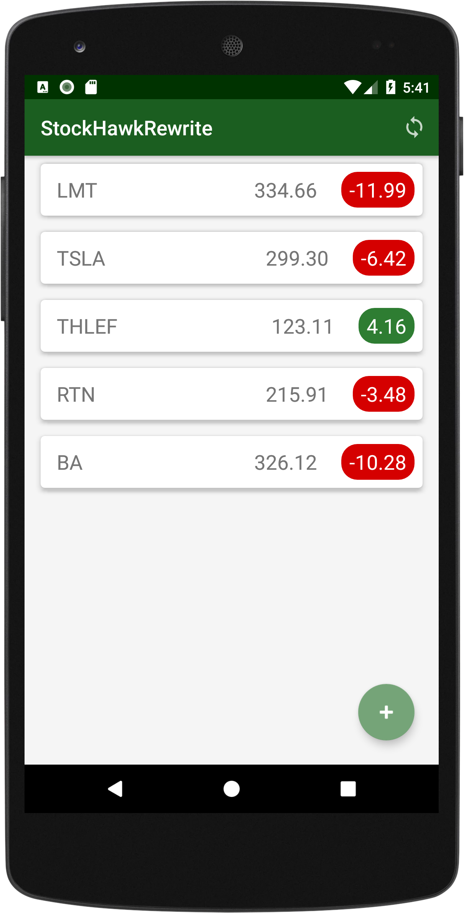
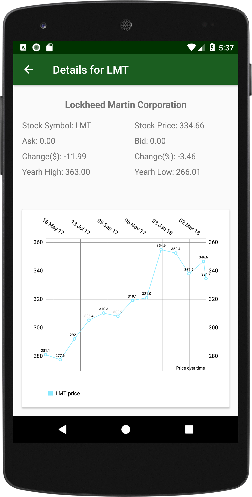
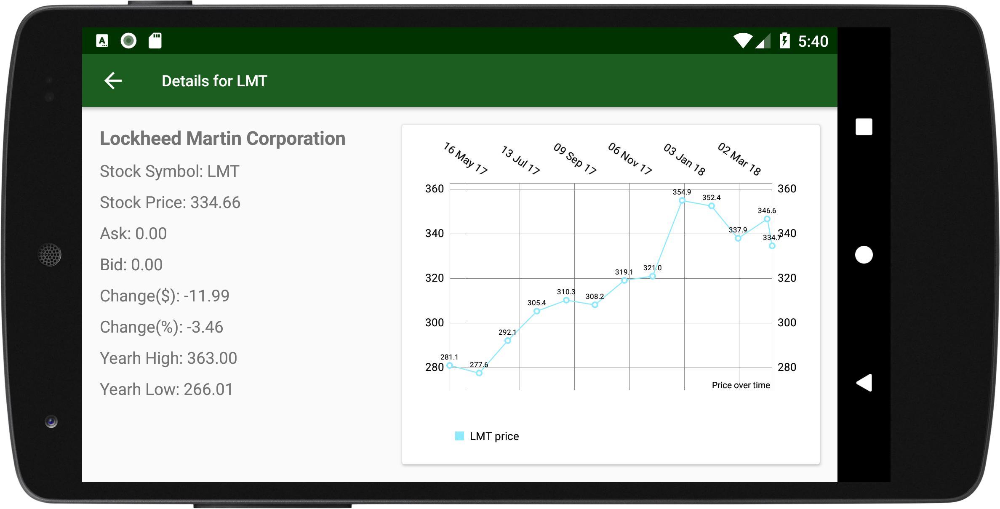

# StockHawkRewrite

This is a complete reboot of the Stock Hawk poject from
Udacity's Android Developer Nanodegree program.
Even though it may not look
too different from the UI standpoint, the internals
went through a complete overhaul.

Heare are some of the features in this version:
- written using **Test Driven Development** practices
- uses MVP design pattern (see UML diagram below)
- uses Room Database
- uses RxJava for asynchronous tasks
- uses RxJava for data-driven UI updates

## Screenshots

  

